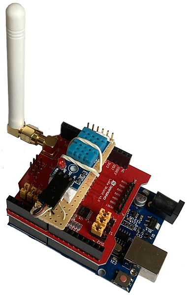
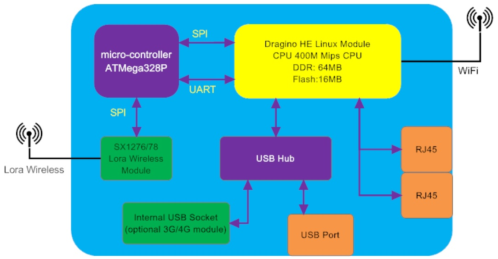

# INEN-dragino-development-kit

This project contains all resources required to use the Dragino LoRa IoT Development Kit V1 for building a temperature sensor sending its values periodically via LoRa to the LG01 LoRa Gateway and from there to a service somewhere on the internet.

## Temperature Sensor

The sensor uses the following components of the development kit:

* Arduino UNO
* LoRa Shield
* temperature sensor ([DHT11](doc/DHT11-Technical-Data-Sheet-Translated-Version-1143054.pdf))

In `src/temperatureSensor` you can find the source code for the Arduino UNO. This file needs to get compile (select "Arduino UNO"as board) and uploaded to the micro controller using the [Arduino IDE](https://www.arduino.cc/en/software). 

To connect the temperature sensor (DHT11) to the micro controller the pin A0 gets used. The following photo shows the sensor hardware. At the bottom there is the Arduino UNO, in the middle you can see the LoRa Shield in the small one on top of it is the temperature sensor.

## Gateway

The following picture (taken from the [LG01 LoRa Gateway User Manual](doc/LG01_LoRa_Gateway_User_Manual.pdf)) illustrates the internal architecture of the LG01 LoRa Gateway.

There are two parts needed to receive messages via LoRa and send them out to the internet. 

The ATMega32BP (purple box in the upper left corner of the diagram) is responsible to collect received messages from the LoRa module and stores them via SPI in the memory of the Dragino HE Linux Module. The last received message gets stored in `/var/iot/data`. The current content of this file gets displayed in the web interface in "Sensor / Sensor Data".

The Linux Module (big yellow box in the diagram) uses [OpenWRT](https://openwrt.org/) as operating system. What we need to do is, create a service that starts automatically when the gateway gets restarted. In an configurable interval it checks if new content is available `/var/iot/data` and sends it to a service on the internet.

### Programming the ATMega32BP
The source code of the receiver part is available in `src/gateway/forwarder.ino`. This code runs on the ATMega32BP and communicates with the LoRa module of the gateway. To compile it in the [Arduino IDE](https://www.arduino.cc/en/software) select the board "Arduino Uno - Dragino Yun". To upload it, don't use the Arduino IDE. Connect your computer to the LAN-port of the gateway and open its web interface. Open the menu "Sensor / Flash MCU" and use the .hex file (generated by the compiler).

Log output will get written to `/var/log/forwarder`.

### Creating the service in the Dragino HE Linux Module

To create a service in [OpenWRT](https://openwrt.org/), all you need to do is ...

1. create a script called `temperaturePublisher.sh` in `/root`
2. copy the content of `src\gateway\root\temperaturePublisher.sh` into it
3. adapt the script to your needs
4. make sure the file is executable
5. create a file called temperaturePublisher in `/etc/init.d`
6. copy the content of `src/gateway/etc/init.d/temperaturePublisher` into it
7. make sure the file is executable
8. enable the new service by calling `/etc/init.d/temperaturePublisher enable`
9. start the service by executing `/etc/init.d/temperaturePublisher start`

A nice description how to create new services is available on the [webpage of OpenWRT](https://openwrt.org/docs/guide-developer/procd-init-script-example).